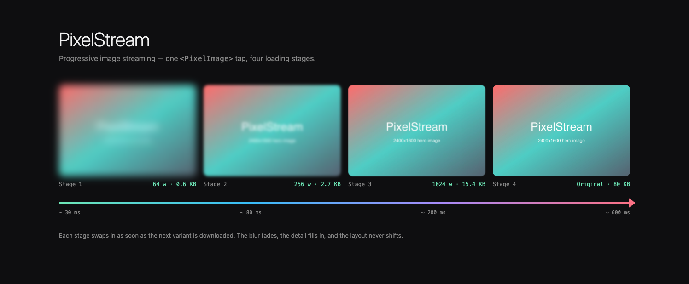
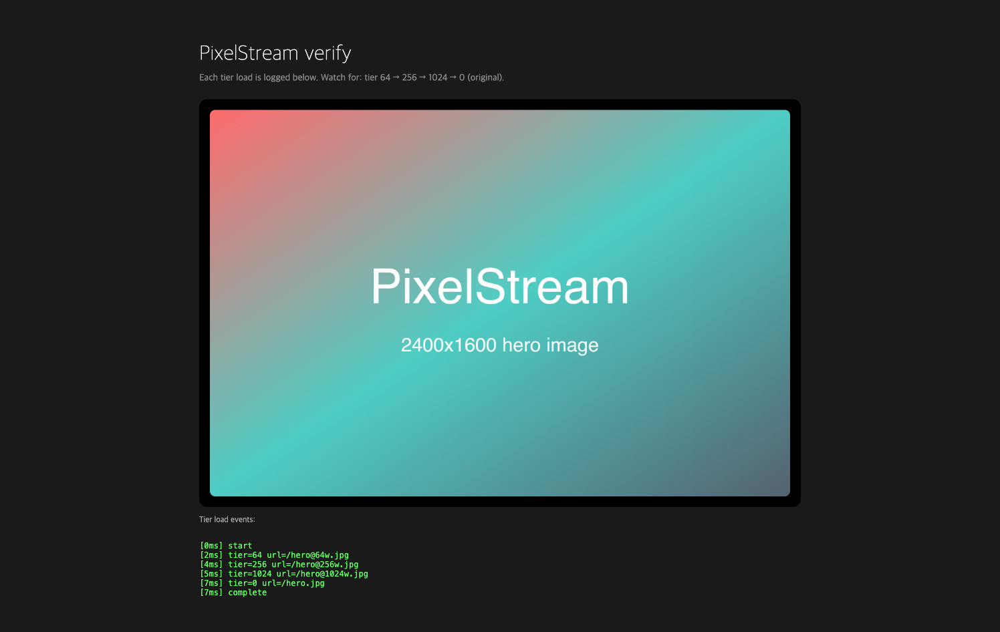

# PixelStream

> **Progressive image streaming for the modern web.** Zero server, drop-in NPM library.



```bash
npm install @pixelstream/react
```

```tsx
import { PixelImage } from '@pixelstream/react'

<PixelImage
  src="https://res.cloudinary.com/x/image/upload/v1/photo.jpg"
  preset="cloudinary"
  alt="..."
/>
```

That's it. The image starts as a 64px blurry placeholder, swaps to 256px, then 1024px, then the original — all inside a smooth 300ms transition.

---

## Why

Every progressive image library on npm today does **one** of these:

- Uses a tiny base64 placeholder (BlurHash / ThumbHash) and then jumps to full quality
- Requires you to run your own image server
- Locks you into a single CDN

PixelStream does **none** of those. It uses URL-based resize parameters that **your existing CDN already supports**, swaps the `` element through several intermediate widths, and works in 3KB of client code.

| | PixelStream | Progressive JPEG | BlurHash | Next.js Image |
| --- | --- | --- | --- | --- |
| Multi-step quality | ✅ N tiers | ✅ scans | ❌ 1 step | ❌ 1 step |
| No re-encode required | ✅ | ❌ | ❌ (needs hash) | ❌ |
| CDN agnostic | ✅ | n/a | n/a | ⚠️ Vercel-tied |
| Bring-your-own server | ❌ | ❌ | ❌ | ❌ |
| Bundle size | 3 KB | n/a | 6 KB | n/a (built-in) |

---

## Packages

| Package | What it is |
| --- | --- |
| [`@pixelstream/core`](./packages/core) | Framework-agnostic `loadProgressive(img, src, options)` |
| [`@pixelstream/react`](./packages/react) | `<PixelImage />` React component |
| [`@pixelstream/element`](./packages/element) | `<pixel-image>` vanilla Web Component |
| [`@pixelstream/cli`](./packages/cli) | Build-time `pixelstream encode` for static hosting |

---

## Usage

### React (any CDN)

```tsx
import { PixelImage } from '@pixelstream/react'

// Cloudinary
<PixelImage
  src="https://res.cloudinary.com/<cloud>/image/upload/v1/photo.jpg"
  preset="cloudinary"
  alt="..."
/>

// ImageKit
<PixelImage src="https://ik.imagekit.io/<id>/photo.jpg" preset="imagekit" alt="..." />

// Imgix
<PixelImage src="https://example.imgix.net/photo.jpg" preset="imgix" alt="..." />

// Bunny CDN
<PixelImage src="https://example.b-cdn.net/photo.jpg" preset="bunny" alt="..." />

// Vercel / Next.js Image API
<PixelImage src="/photo.jpg" preset="vercel" alt="..." />

// Supabase Storage Image Transform
<PixelImage
  src="https://x.supabase.co/storage/v1/object/public/bucket/photo.jpg"
  preset="supabase"
  alt="..."
/>
```

### React (static / no CDN)

```bash
# 1. Pre-generate variants at build time
npx pixelstream encode public/images
# -> public/images/photo@64w.jpg, photo@256w.jpg, photo@1024w.jpg
```

```tsx
import { PixelImage } from '@pixelstream/react'

<PixelImage src="/images/photo.jpg" preset="static" alt="..." />
```

### Custom transformer

```tsx
<PixelImage
  src="https://my-custom-cdn.com/photo.jpg"
  preset={(src, w) => `${src}?size=${w}`}
  alt="..."
/>
```

### Vanilla Web Component (any framework, no framework, plain HTML)

```html
<script type="module">
  import '@pixelstream/element'
</script>

<pixel-image
  src="/images/photo.jpg"
  preset="static"
  alt="..."
  lazy
></pixel-image>
```

### Vanilla JS (imperative)

```ts
import { loadProgressive } from '@pixelstream/core'

const img = document.querySelector('img.lazy')!
await loadProgressive(img, '/images/photo.jpg', {
  preset: 'static',
  tiers: [64, 256, 1024],
  blur: 8,
  transition: 300,
  lazy: true,
})
```

---

## Options

```ts
interface LoadOptions {
  preset?: 'cloudinary' | 'imagekit' | 'imgix' | 'vercel' | 'supabase' | 'bunny' | 'static' | ((src, w) => string)
  tiers?: readonly number[]      // default [64, 256, 1024]
  loadOriginal?: boolean         // default true (load full-resolution as last step)
  blur?: number                  // default 8 (CSS blur on first tier)
  transition?: number            // default 300 ms
  lazy?: boolean | IntersectionObserverInit  // default false; true = wait for viewport entry (200px margin)
  fallback?: string              // URL to use if any tier fails to load
  onTierLoad?: (tier: number, url: string) => void
  onComplete?: () => void
  onError?: (error: Error) => void
  signal?: AbortSignal
}
```

---

## How it works



```
[Browser]                       [CDN / Static host]
   │
   │ 1. Request width=64        →  small JPEG (~3 KB)
   ◄                            ←  ~30 ms later: full image visible (blurred)
   │
   │ 2. Request width=256       →  medium JPEG (~15 KB)
   ◄                            ←  swap, blur softens
   │
   │ 3. Request width=1024      →  large JPEG (~150 KB)
   ◄                            ←  swap, blur smaller
   │
   │ 4. Request original        →  full JPEG (~4 MB)
   ◄                            ←  final swap, blur removed
```

The browser caches each tier independently. On revisit / scroll-back, the same image renders instantly from cache.

### Verified end-to-end

The screenshot above is real Chromium rendering with `loadProgressive` actually swapping the `` element through four tiers. Tier load timeline from the same run:

```
[0ms]  start
[2ms]  tier=64   url=/hero@64w.jpg     0.6 KB
[4ms]  tier=256  url=/hero@256w.jpg    2.7 KB
[5ms]  tier=1024 url=/hero@1024w.jpg  15.4 KB
[7ms]  tier=0    url=/hero.jpg        80.0 KB (original)
[7ms]  complete
```

---

## Status

🟡 v0.1 — initial release. APIs may change before v1.0.

---

## License

[MIT](./LICENSE) © Sage
